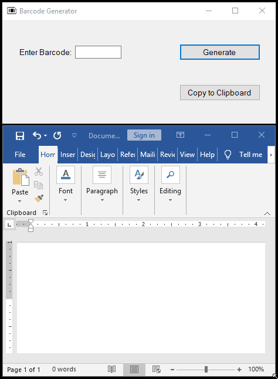

# Match Game

## Table of contents
* [Introduction](#introduction)
* [Demo](#demo)
* [Technologies](#technologies)
* [Status](#status)

## Introduction
Program generates barcode in Code39 format commonly used to manage backup media in tape backup systems. 

## Demo

## Technologies
C#

## Status
Complete